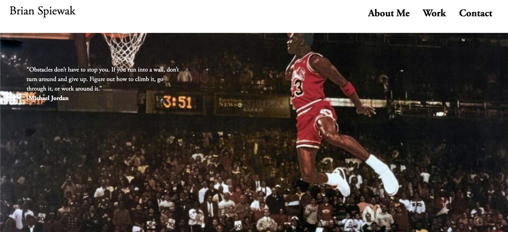

## Brian Spiewak's Portfolio 
## Description
This project was to create my first portfolio website displaying projects I have created myself and been a contributor to. This app intends to show my web development skills as I am currently studying to become a full stack web developer in the University of Pennsylvania's LPS Coding Bootcamp.

## Table of Contents
* [Technologies](#technologies)
* [Screenshot](#screenshot)
* [Requirements](#requirements)
* [Links](#links)

## Technologies
1. HTML
2. Advanced CSS
    * Flexbox
    * CSS Grid
    * Media Query
    * Bootstrap CSS Framework

## Screenshot

## Requirements
1. This project was to present my portfolio website with name, recent photo, and links to sections about me, my work and how to contact me
2. Create links in the navigation and add CSS so that the UI scrolls to corresponding section
3. Create section about my work, use links in nav to scroll to this section 
4. Show my portfolio applications using an image of the website and when clicked, it takes user to deployed site
5. Placeholder images for other applications that will be swapped out later on in class
6. Make application fully responsive for various screen sizes and devices

## Links
* [Portfolio Deployed Site Link](https://bspiewak6.github.io/portfolio/) 
* [Portfolio Github Repository](https://github.com/bspiewak6/portfolio)

